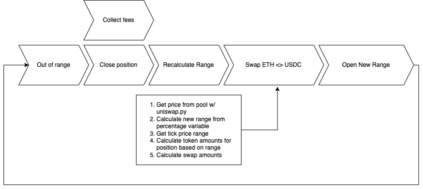

# uniswap-delta-neutral-hedge-hft

Uniswap High-Frequency Trading w/ Delta Neutral Positions

## Overview

This is a high-frequency trading bot that uses Uniswap and a CEX to trade a delta neutral position. The bot will enter a Uniswap position in a crypto & stablecoin pool for a tight range while opening a short position in the equivalent amount of the token side. The bot will also rebalance the position if the price of the token moves out of the range. To rebalance the position, the bot closes the Uniswap position and the CEX position and then reopens them at the new price, while collecting fees in the process.

## Simplified Flow of Strategy

## Requirements

- Python 3.10
- EVM compatible private key (e.g., Ethereum, Polygon, etc.)
- [Optional] API keys for a CEX (e.g., Binance, FTX, etc.) compatible with ccxt
- [Optional] Telegram bot token

## Table of Contents

- [Makefile Documentation](./docs/README-makefile.md)
- [uniswap_hft.uniswap_math](./docs/README-uniswap_math.md)
- [uniswap_hft.trading_engine](./docs/README-trading_engine.md)
- [uniswap_hft.web_manager](./docs/README-web_manager.md)
- [uniswap_hft.api](./docs/README-api.md)
- [uniswap_hft.telegram_interface](./docs/README-telegram_interface.md)
- [uniswap_hft.scheduler](./docs/README-scheduler.md)

