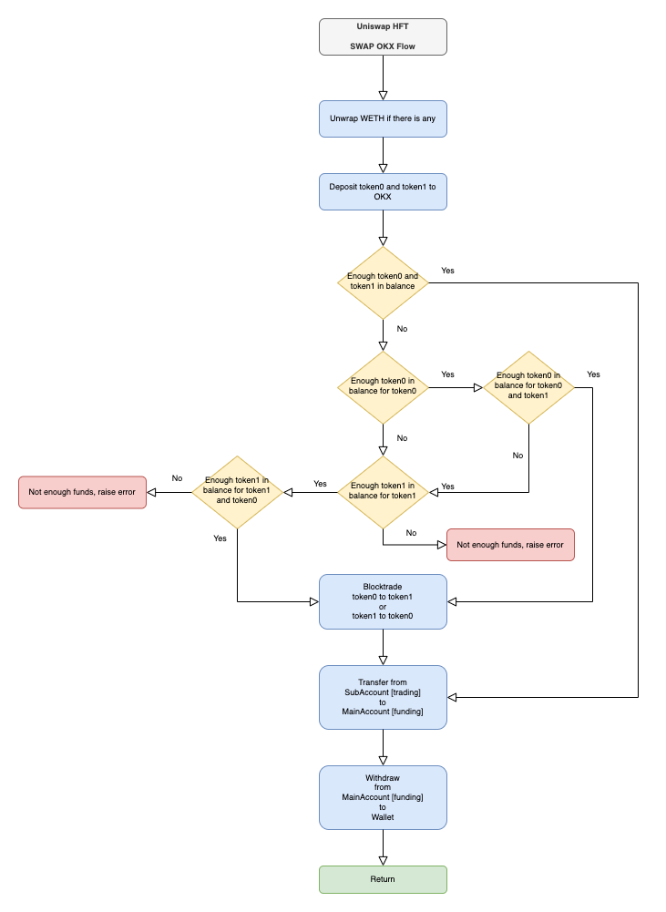

[Back to Main README](../README.md)

## uniswap_hft.web_manager

The Web Manager module houses the `Web3Manager` class that is utilized to manage the web3 connection and the Uniswap contract. It is responsible for initializing the connection, opening positions, and maintaining the positions by periodically updating them.

---

### Class: `Web3Manager`
#### Modules and Classes

1. **Imports**:
    - Standard Libraries: `datetime`, `json`, `logging`, `math`, `time`, and `typing`.
    - Third Party Libraries: `eth_typing.evm` and `web3.types`.
    - Local Libraries: Various modules from `uniswap_hft`.

2. **Custom Exceptions**:
    - `InsufficientFunds`: Raised when there's not enough funds for an operation.
    - `BlocktradeFailed`: Raised if there's an issue during a block trade.
    - `DepositFailed`: Raised if a deposit operation fails.
    - `TransferFailed`: Raised if a transfer operation fails.
    - `WithdrawFailed`: Raised if a withdrawal operation fails.
    - `WithdrawTimeout`: Raised when a withdrawal takes too long.

3. **Functions**:
    - `lock(func)`: A decorator that locks a function's execution if it's already in progress.
    - `round_down(number: float, decimals: int = 0) -> float`: Rounds down a number to a given number of decimal places.

4. **Class Web3Manager**:
    - **Description**: Class for managing the web3 connection and the Uniswap contract.
    
    - **Methods**:
        1. `__init__`: Initializes the manager with pool details, wallet information, provider details, and other configuration.
        2. `lock_on`: Engages the lock with a provided message.
        3. `lock_off`: Releases the lock with a provided message.

    - **Attributes**:
        - Essential attributes: `pool_address`, `pool_fee`, `wallet_address`, `wallet_private_key`, `range_percentage`, `usd_capital`, `provider`.
        - Optional configurations: `burn_on_close`, `debug`, `position_history_path`, `cex_credentials`, and `telegram_credentials`.
        - Miscellaneous attributes: `lock`, `logger`, `background_process`, `position_history`, `uniswap`, `decimal0`, `decimal1`, `token0`, `token1`, and many more.

---

#### Usage and Examples:
1. **Using the `Web3Manager` class**:

    Initialize an instance:

    ```python
    manager = Web3Manager(
        pool_address="some_address",
        pool_fee=0.03,
        wallet_address="wallet_address",
        wallet_private_key="private_key",
        range_percentage=5,
        usd_capital=1000,
        provider="infura",
        burn_on_close=False,
        debug=True,
        position_history_path="position_history.json",
        cex_credentials={"main": {...}, "subaccount": {...}},
        telegram_credentials={"bot_token": "token", "chat_id": "chat_id"}
    )
    ```

2. **Using the `lock` decorator**:

    It can be used as a decorator to ensure a function doesn't execute simultaneously.

    ```python
    @lock
    def some_function():
        # Some logic here
        pass
    ```

    Engage and release locks:
    ```python
    manager.lock_on("Some lock reason")
    manager.lock_off("Lock reason over")
    ```

#### Trading Mechanism

This strategy is basically managing Uniswap LP positions in an automated way, by using a predefined range percentage and monitoring the price movement within the range. In case the price moves over or under the existing LP range, it will initiate a close (decrease liquidity in pool, collect funds, burn LP NFT token). After closing the position the retrieved funds are exchanged to around 50% / 50% and a new position will be open. This mechanism may happen multiple times a day depending on the predefined range. 

There are two main modes to operate this strategy:

- on-chain swap: which simply makes the exchange of tokens required for opening the new position inside the given Uniswap pool
- off-chain swap: which deposits the funds to OKX and makes a Block Trading RFQ to swap tokens on a predefined maximum spread basis.

##### Off-chain swap in-detail

The off-chain swap is quite complex in its operation due to the multi-step process it goes through and different possible errors it can throw. 

1. Calculate required amounts for new LP position
2. Checks funds in the on-chain wallet
3. Unwrap WETH to ETH if there are any
4. Deposit funds into OKX of both ETH and stablecoin if there are any
5. Check received fund amounts and compare with requirements
    1. If the sum of the tokens does not meet the required amounts for the LP, throw an error that `Not enough funds for position, please deposit funds to OKX Subaccount`
    2. If either tokens are less than requirement, but the other token is sufficient in a way that its surplus is enough for the shortfall of the other then it will do a block trade via RFQ
        1. If there are no quotes received for example ETH-USDC, it wii re-route to ETH-USDT and then it will do a USDT-USDC block trade also
    3. If both of the tokens are sufficient for the required LP opening, it will not do a swap
6. Transfer funds to Main Account for withdrawal
7. Withdraw funds from Main Account to on-chain wallet
8. Wait for withdrawals to arrive
9. Recalculate position with the obtained funds
10. Open the position by minting 
11. Periodically call the update function and see if the price is still inside our range
12. Rinse and repeat

##### On-chain swap flow
---

